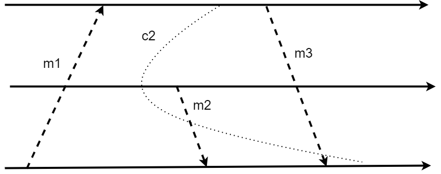

## Practica 6: Sistemas Distribuidos

**1)** Una vez llegados los dos comandos con el mismo timestamp, lo que se suguiere es que la prioridad esté puesta en el que tenga el menor tiempo, en caso de que los mensajes ingresantes tengan el mismo tiempo se ordenan los mensajes por identificador de proceso.

    // works es una cola de mensajes que seran ejecutados por los nodos
    // m1 : mensaje de nodo1
    // m2 : mensaje de nodo2
    // ID1 : identificador del nodo1
    // ID2 : identificador del nodo2
    // t1 : timestamp del mensaje del nodo1
    // t2 : timestamp del mensaje del nodo2

    if t1 < t2 then
        works.enqueu(m1)
        works.enqueu(m2)
    else if t1 > t2 then
        works.enqueu(m2)
        works.enqueu(m1)
    else 
        if ID1.ip < ID2.ip then
            works.enqueu(m1)
            works.enqueu(m2)
        else if ID1.ip > ID2.ip then
            works.enqueu(m2)
            works.enqueu(m1)
        else if ID1.port < ID2.port then
            works.enqueu(m1)
            works.enqueu(m2)
        else
            works.enqueu(m2)
            works.enqueu(m1)

**2)** El algoritmo trabajaria de la siguiente manera:

Cada nodo cuenta con un id unico que lo diferencia del resto.

Cada mensaje enviado debe tener un identificador único, un número de identificacion del nodo que lo envio y un número de secuencia que sera inicalmente 0. Esto permite a los nodos identificar el orden de los mensajes.

> Partes:

Broker Central: actua como intermediario para recibir y redistribuir los mensajes. Será responsable de mantener el orden de los mensajes. Este cuenta con una cola de distribución.

Nodos: participantes del sistema.

> Proceso:

Cuando un nodo envía un mensaje, el broker lo recibe, le asigna un valor de secuencia (sustituyendo el 0) y lo almacena en una cola de mensajes.

Para la asignación de un número de secuencia, el broker emplea el algoritmo del inciso anterior con el cual define que mensaje tiene mas precedencia.

Confirmación de Recepción: Cada nodo que recibe un mensaje debe enviar una confirmación de recepción al broker. Solo cuando el broker recibe confirmación de cada nodo para un mensaje específico, puede proceder a enviar el siguiente mensaje en la cola y sacar esa instruccion de su subcola.

Reintentos: En caso de que un mensaje no sea confirmado por un nodo dentro de un tiempo determinado, el broker puede reintentar enviar el mensaje dos veces más.

Finalización: Una vez que todos los mensajes han sido entregados y confirmados, el broker puede cerrar la sesión o continuar con el siguiente ciclo de mensajes.

**3)** 

⇒ El corte (c2) es inconsistente por la razón de que abarca el recibir del mensaje m2 y el recibir de m3, pero no cubre el enviar de ninguno de los dos, lo cual no corresponde con la idea.

**4)**  Desde el punto de vista de réplicas, los algoritmos de consenso mantienen que todos los nodos involucrados en el sistema distribuido deben llegar a un acuerdo común sobre el estado de los elementos replicados. Y ayudan a solucionar el problema de la siguiente manera:

*   **Mantenimiento de la coherencia**: todos los nodos tengan una visión consistente del estado de los elementos replicados.

*   **Resolución de conflictos**: En caso de que surjan conflictos entre los nodos debido a actualizaciones concurrentes o fallos en la comunicación, proporcionan un mecanismo para resolver estos conflictos y llegar a un acuerdo común.

*   **Garantía de la integridad**: aseguran que los datos replicados sean consistentes y no se pierdan o corrompan durante la replicación.

**6)**  Asumimos una topología de árbol la cual produce una secuencia de bloqueos desde la raiz hasta las hojas, ademas, asumimos que no hay errores y que los mensajes que se envian son los de barrier y barrier ack.

Inicialización: 
Cada proceso tiene un identificador único y conoce el número de procesos hijos.

Fase de Entrada:
Cada proceso llama a la función barrier().
Se obtinen el rank del proceso y el conjunto de sus procesos hijos.

Fase de comunicación:
Cada proceso que no tenga hijos (nodos hojas) envia a su padre un mensaje "barrier" indicando que se bloqueo,
luego se queda esperando un mensaje "barrier ack" el cual le permite seguir con su ejecución.

Cada proceso con hijos comienza a recibir los mensajes "barrier" de sus procesos hijos, luego de recibirlos todos, envia un mensaje "barrier" a su padre y se queda esperando una confirmación, y por ultimo envia un mensaje "barrier ack" a sus hijos.

Fase de salida:
Todos los procesos continúan con su ejecución después de recibir el barrier ack.

    function barrier() {
        // Obtener el idetificador del proceso
        rank = get_rank()  
        // Obtener la cantidad de nodos hijos
        children = get_children()  

        // nodo raiz es quien lleva el registro

        if len(children) > 0 {
            for i on children do
                // Recibir mensaje de otro nodo (bloquea nodo)
                receive_from(children)  
            end for

            parent = get_parent()
            if parent {
                send_to(parent, "barrier")
                // Recibimos el ack del padre
                receive_from(parent)
            }

            for i on children do
                // Responde a los nodos
                send_to(i, "barrier ack")
            end for
        } else {

            parent = get_parent(rank)
            // Enviar conteo local al padre
            send_to(parent, "barrier")

            // Esperar la respuesta del nodo raiz (ack)
            receive_from(parent)  
        }
    }